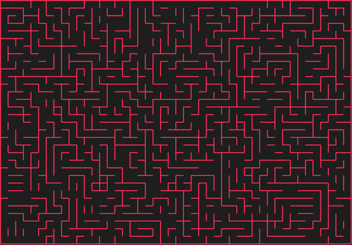

#  MazeGenerator

A CoreGraphics-based project to generate and display mazes on screen.

There are currently two algorithms implemented to generate mazes, although adding new algorithms is trivial. Algorithms implemented must conform to protocol `MazeGeneratorAlgorithm` to be able to be used to generate a maze. The two existing algorithms are the [Recursive Backtracker](https://en.wikipedia.org/wiki/Maze_generation_algorithm#Recursive_implementation) and the [Aldous-Broder](http://weblog.jamisbuck.org/2011/1/17/maze-generation-aldous-broder-algorithm) algorithms.
